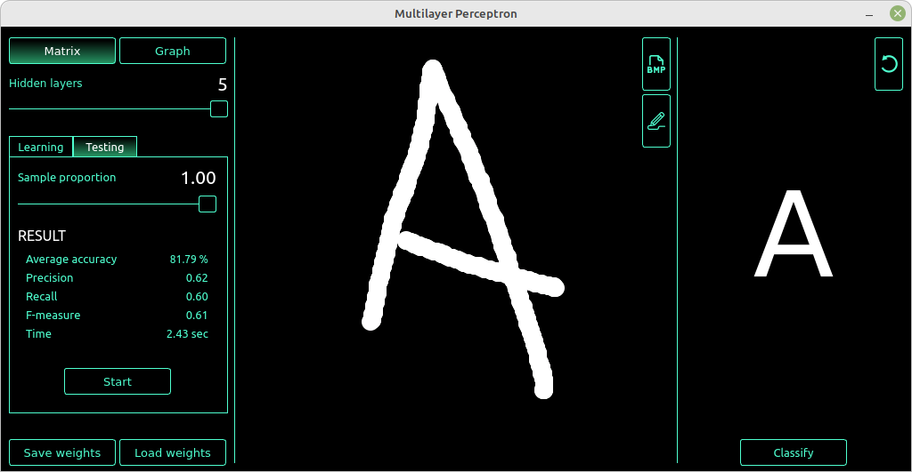

# Multilayer Perceptron

## Contents

- [Multilayer Perceptron](#multilayer-perceptron)
  - [Contents](#contents)
  - [Intro](#intro)
  - [Stack](#stack)
  - [Installataion](#installataion)
  - [Testing](#testing)
  - [Usage](#usage)
  - [Contributors](#contributors)

## Intro

A simple artificial neural network in the form of a perceptron, which was trained on an open dataset to perform recognition of 26 handwritten letters of the Latin alphabet. The perceptron core part is implemented in two ways: matrix form and graph form.

## Stack

- GUI: **Qt**
- Model: **C++17**

## Installataion

- Install application with:
  - `make install`
- Uninstall application with:
  - `make uninstall`
- Create distributive:
  - `make dist`

## Testing

- Run tests for model part:
  - `make tests`
- Check the code for compliance with Google style:
  - `make style`
- Check the code for compliance with cppcheck:
  - `make cppcheck`

## Usage

- Choose between matrix or graph implementation
- Choose number of hidden layers
- Either start learning on a predefined dataset or load weights from file
- Either draw symbol by hand or load *.bmp image from file
- Press classify button

## Contributors

- wmicha (Dmitriy Nikitin)
- hmetallo (Leonid Karataev)
- hsensor (Alexey)
